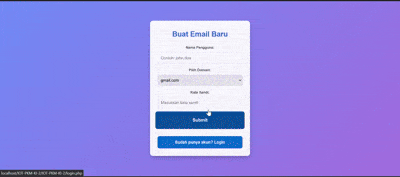

# IoT Hydroponics Monitoring System

## Project Description

This project is an IoT-based hydroponics monitoring system that enables users to monitor critical parameters such as pH, humidity, water temperature, and TDS levels in real time. The system is designed to support hydroponic farmers in managing their crops efficiently and conveniently. Dokumentasi [here](https://docs.google.com/document/d/1InskTcacH38CUNy5jcr9j0o9Ob-vJ__HIbuv-F-01d8/edit?usp=sharing)

    

## Key Features

- **Hydroponics Parameter Monitoring**: Includes pH, humidity, water temperature, and TDS levels.
- **User Authentication**: Login system for both users and administrators.
- **Interactive Dashboard**: Displays real-time data.
- **IoT Connectivity**: Integration with IoT devices for data acquisition.

## Project Structure

- **PHP Files**:
  - `account.php`: Manages user accounts.
  - `dashboard.php`: Provides the main interface for monitoring data.
  - `koneksi.php`: Script for connecting the application to the database.
  - `login.php` and `loginadmin.php`: Login pages for users and administrators.
  - `logout.php`: Script to terminate user sessions.
- **Python Script**:
  - `hidroponik.py`: Handles IoT communication and sensor data collection.
- **HTML Files**:
  - `kelembapan.html`: Displays humidity data.
  - `pH.html`: Displays pH data.
  - `suhuair.html`: Displays water temperature data.
  - `tds.html`: Displays TDS data.
- **CSS Directory**: Contains stylesheets for the user interface.

## How to Use

1. **Server Setup**:
   - Ensure a web server like XAMPP or Apache is installed.
   - Place all files in the server directory (e.g., `htdocs` for XAMPP).
2. **Database Configuration**:
   - Create a database in MySQL as per the `koneksi.php` script.
   - Import the database schema if provided.
3. **Run the Application**:
   - Access the application via a browser using the local server URL.
4. **Connect IoT Devices**:
   - Run `hidroponik.py` to start collecting data from IoT devices.

## Prerequisites

- Python 3.x
- Web server with PHP support
- MySQL database
- Compatible IoT hardware

## Contribution

If you wish to contribute to this project, please create a pull request or open an issue in this repository.

## License

This project is licensed under the MIT License.
